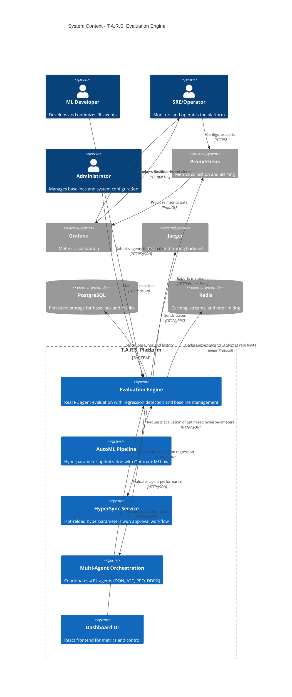
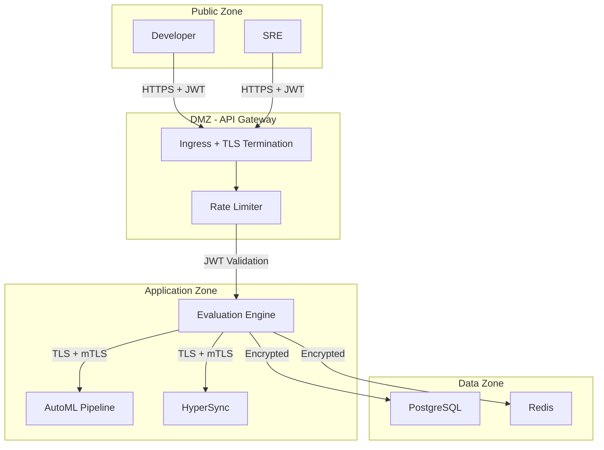

# C4 Level 1: System Context Diagram

## T.A.R.S. Evaluation Engine - System Context

This diagram shows how the Evaluation Engine fits within the broader T.A.R.S. ecosystem and its interactions with external actors and systems.



## Key Interactions

### 1. Developer Workflow
```
Developer → Evaluation Engine:
  POST /v1/evaluate
    {
      "agent_type": "dqn",
      "hyperparameters": {...},
      "environments": ["CartPole-v1"],
      "num_episodes": 100,
      "detect_regressions": true
    }

Evaluation Engine → Developer:
  200 OK
    {
      "job_id": "uuid",
      "results": {
        "CartPole-v1": {
          "metrics": {...},
          "regression": {...},
          "nash_scores": {...}
        }
      }
    }
```

### 2. AutoML Integration
```
AutoML Pipeline → Evaluation Engine:
  POST /v1/evaluate (with optimized hyperparameters)

Evaluation Engine → AutoML Pipeline:
  Returns metrics for Optuna objective function

AutoML Pipeline → MLflow:
  Logs metrics + hyperparameters
```

### 3. Regression-Triggered Hot-Reload
```
Evaluation Engine → (Detects Regression):
  RegressionDetector.detect() → is_regression=True, severity=high

Evaluation Engine → HyperSync:
  POST /v1/rollback
    {
      "agent_type": "dqn",
      "reason": "Regression detected: -15% reward drop"
    }

HyperSync → Orchestration:
  Reverts to previous stable hyperparameters
```

### 4. Observability Flow
```
Evaluation Engine → Prometheus:
  Exports:
    - tars_eval_evaluations_total
    - tars_eval_duration_seconds
    - tars_eval_regression_detected_total

Prometheus → Grafana:
  Queries metrics via PromQL

Grafana → SRE:
  Displays dashboards, fires alerts
```

## External Dependencies

| System | Purpose | Protocol | Criticality |
|--------|---------|----------|-------------|
| PostgreSQL | Baseline storage | SQL | **Critical** |
| Redis | Environment cache, rate limiting | Redis | **High** |
| Prometheus | Metrics collection | HTTP | Medium |
| Jaeger | Distributed tracing | OTLP/gRPC | Low |
| AutoML | Upstream optimizer | HTTP/JSON | High |
| HyperSync | Downstream hot-reload | HTTP/JSON | High |

## Security Boundaries



## Deployment Context

- **Kubernetes Cluster**: All services run as pods
- **Namespace**: `tars` (production) or `tars-staging`
- **Ingress**: TLS termination with cert-manager
- **Service Mesh**: Optional Istio for mTLS
- **Multi-Region**: Active-active with cross-region replication (Phase 6-9)

## Failure Modes

1. **PostgreSQL Down**: Evaluation fails, returns 503
2. **Redis Down**: Environment cache disabled, rate limiting degraded
3. **Prometheus Down**: Metrics lost, no alerts
4. **Jaeger Down**: Traces lost, no impact on functionality
5. **AutoML Down**: Eval engine continues serving direct requests
6. **HyperSync Down**: Regression detection works, rollback unavailable

---

**Next Level**: [C4 Level 2 - Container Diagram](C4_Level2_Container.md)
