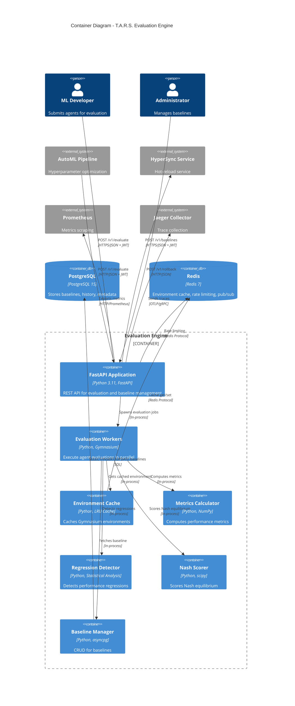
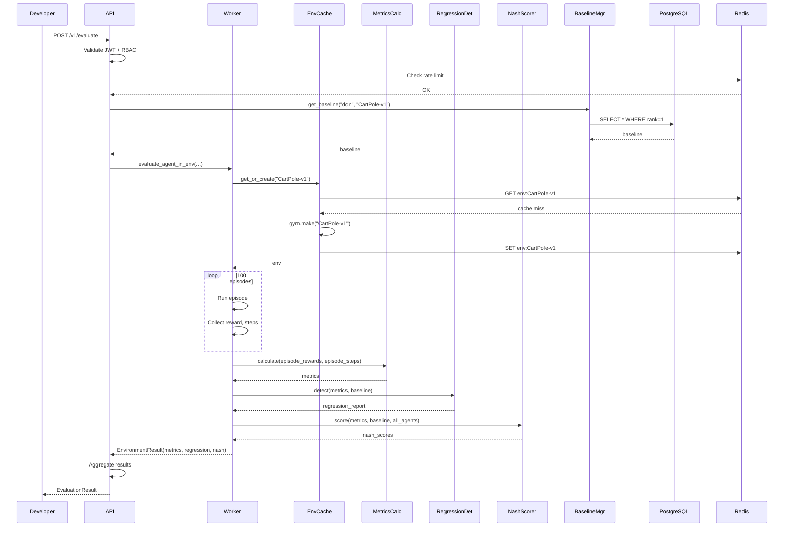

# C4 Level 2: Container Diagram

## T.A.R.S. Evaluation Engine - Container Architecture

This diagram shows the containers (applications, services, databases) that make up the Evaluation Engine system.



## Container Details

### 1. FastAPI Application (Port 8099)

**Responsibilities:**
- HTTP request handling
- JWT authentication and RBAC
- Rate limiting
- Request validation
- Response serialization
- Metrics export
- Health checks

**Technology:**
- FastAPI 0.104.1
- Pydantic for validation
- prometheus_client for metrics
- OpenTelemetry for tracing

**Key Routes:**
- `POST /v1/evaluate` - Submit agent evaluation
- `GET /v1/jobs/{job_id}` - Get job status
- `GET /v1/baselines/{agent_type}` - Get baseline
- `POST /v1/baselines` - Update baseline
- `GET /health` - Health check
- `GET /metrics` - Prometheus metrics

**Dependencies:**
```python
# Internal
from workers import AgentEvaluationWorker
from baseline_manager import BaselineManager
from shared.auth import get_current_user, Role
from shared.rate_limiter import rate_limit_middleware

# External
import asyncpg
import redis.asyncio
```

### 2. Evaluation Workers

**Responsibilities:**
- Load agent with hyperparameters
- Execute episodes in Gymnasium environments
- Collect episode rewards and steps
- Aggregate results
- Handle worker failures

**Worker Pool Configuration:**
```python
EVAL_MAX_CONCURRENT = 4  # Max parallel evaluations
EVAL_WORKER_TIMEOUT = 600  # 10 minutes per eval
```

**Execution Flow:**
```
1. Load agent class (DQN/A2C/PPO/DDPG)
2. Initialize with hyperparameters
3. Get environment from cache
4. For each episode:
   - Reset environment
   - Run agent until done
   - Collect reward, steps
5. Return episode_rewards, episode_steps
```

### 3. Environment Cache

**Purpose:** Reduce overhead of creating Gymnasium environments

**Implementation:**
```python
class EnvironmentCache:
    def __init__(self, max_size: int = 50):
        self._cache: OrderedDict[str, gym.Env] = OrderedDict()
        self._max_size = max_size
        self._redis: aioredis.Redis = None

    async def get_or_create(self, env_name: str) -> gym.Env:
        # LRU eviction logic
        # Fallback to Redis for distributed cache
```

**Cache Strategy:**
- **L1**: In-memory LRU (50 environments)
- **L2**: Redis (serialized if supported)
- **Miss**: Create new environment

**Metrics:**
```
tars_eval_env_cache_size
tars_eval_env_cache_hits_total
tars_eval_env_cache_misses_total
```

### 4. Metrics Calculator

**Computes:**
- `mean_reward`: np.mean(episode_rewards)
- `std_reward`: np.std(episode_rewards)
- `min_reward`, `max_reward`
- `success_rate`: fraction of episodes with reward > threshold
- `mean_steps`: average episode length

**Example:**
```python
metrics = MetricsCalculator.calculate(
    episode_rewards=[195.5, 200.0, 189.3, ...],
    episode_steps=[195, 200, 189, ...]
)
# → MetricsResult(mean_reward=195.5, std_reward=12.3, ...)
```

### 5. Regression Detector

**Algorithm:**
```python
class RegressionDetector:
    def detect(
        self,
        current_metrics: MetricsResult,
        baseline: BaselineRecord
    ) -> RegressionReport:
        # 1. Reward drop check
        reward_drop_pct = (baseline.mean_reward - current_metrics.mean_reward) / baseline.mean_reward
        if reward_drop_pct > EVAL_REWARD_DROP_PCT:  # 0.10 = 10%
            return is_regression=True, severity="high"

        # 2. Failure rate check
        failure_rate = 1 - current_metrics.success_rate
        if failure_rate > EVAL_FAILURE_RATE:  # 0.15
            return is_regression=True, severity="medium"

        # 3. Variance explosion check
        if current_metrics.std_reward > baseline.std_reward * EVAL_VARIANCE_MULTIPLIER:  # 2.5x
            return is_regression=True, severity="low"

        return is_regression=False, severity="none"
```

**Severity Levels:**
- **Critical**: >20% reward drop
- **High**: 10-20% reward drop
- **Medium**: High failure rate (>15%)
- **Low**: Variance explosion
- **None**: No regression

### 6. Nash Scorer

**Purpose:** Score multi-agent stability using Nash equilibrium concepts

**Algorithm:**
```python
class NashScorer:
    def score(
        self,
        agent_type: str,
        current_metrics: MetricsResult,
        baseline: BaselineRecord,
        all_agents_metrics: Dict[str, MetricsResult]
    ) -> NashScores:
        # 1. Compute conflict score (reward variance across agents)
        conflict_score = np.std([m.mean_reward for m in all_agents_metrics.values()])

        # 2. Deviation from equilibrium (distance from baseline)
        deviation = abs(current_metrics.mean_reward - baseline.mean_reward)

        # 3. Stability score (inverse of conflict + deviation)
        stability_score = 1.0 / (1.0 + conflict_score + deviation)

        # 4. Recommendation
        if stability_score > 0.9:
            return "accept"
        elif stability_score > 0.7:
            return "review"
        else:
            return "reject"
```

### 7. Baseline Manager

**Database Schema:**
```sql
CREATE TABLE eval_baselines (
    id UUID PRIMARY KEY,
    agent_type VARCHAR(50),
    environment VARCHAR(100),
    mean_reward DOUBLE PRECISION,
    std_reward DOUBLE PRECISION,
    success_rate DOUBLE PRECISION,
    hyperparameters JSONB,
    rank INTEGER,  -- 1=current best, 2=previous, etc.
    version INTEGER,
    created_at TIMESTAMPTZ,
    UNIQUE (agent_type, environment, rank)
);
```

**Operations:**
```python
class BaselineManager:
    async def get_baseline(agent_type, environment, rank=1) -> BaselineRecord
    async def get_baseline_history(agent_type, environment, limit=10) -> List[BaselineRecord]
    async def update_baseline_if_better(agent_type, environment, metrics, hyperparams) -> str
    async def demote_ranks(agent_type, environment) -> None  # Shift rank 1→2, 2→3, etc.
```

## Data Flow: Evaluation Request



## Scaling Strategy

### Horizontal Scaling (HPA)
```yaml
minReplicas: 2
maxReplicas: 10
targetCPUUtilizationPercentage: 70
```

**Considerations:**
- **Stateless API**: All state in PostgreSQL/Redis
- **Worker Pool**: Each pod has its own worker pool (4 workers)
- **Environment Cache**: Pod-local cache, shared via Redis L2

### Vertical Scaling
```yaml
resources:
  requests:
    cpu: "2"
    memory: "4Gi"
  limits:
    cpu: "4"
    memory: "8Gi"
```

**Rationale:**
- Gymnasium environments are CPU-intensive
- NumPy operations benefit from multiple cores
- 4Gi memory for environment cache (50 envs × ~80MB each)

## Failure Handling

| Failure | Detection | Recovery |
|---------|-----------|----------|
| PostgreSQL connection lost | Health check fails | Retry with exponential backoff, return 503 |
| Redis connection lost | Cache miss | Disable cache, continue with direct env creation |
| Worker timeout | asyncio.timeout | Kill worker, return partial results or error |
| Environment creation fails | gym.make() raises | Return 400 with error message |
| Rate limit exceeded | Redis counter | Return 429 with retry-after header |

## Security Model

### Authentication Flow
```
1. User → POST /auth/login
2. API validates credentials
3. API returns JWT (access + refresh)
4. User → POST /v1/evaluate + Authorization: Bearer <token>
5. API validates JWT signature + expiry
6. API checks role (developer/admin required)
7. API executes request
```

### Authorization Matrix

| Endpoint | Viewer | Developer | Admin |
|----------|--------|-----------|-------|
| POST /v1/evaluate | ❌ | ✅ | ✅ |
| GET /v1/jobs/{id} | ✅ | ✅ | ✅ |
| GET /v1/baselines/{type} | ✅ | ✅ | ✅ |
| POST /v1/baselines | ❌ | ❌ | ✅ |
| GET /health | ✅ (no auth) | ✅ (no auth) | ✅ (no auth) |

---

**Next Level**: [C4 Level 3 - Component Diagram](C4_Level3_Component.md)
