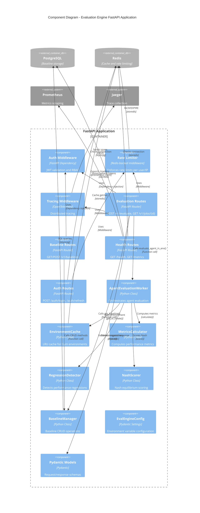
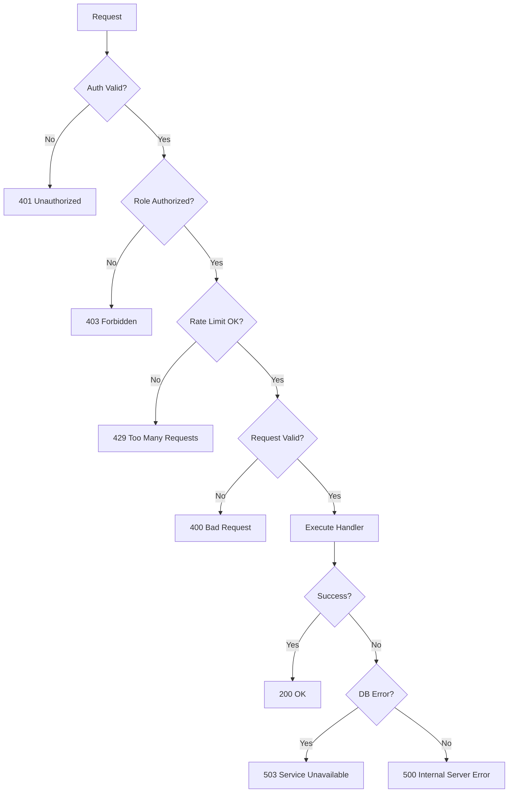

# C4 Level 3: Component Diagram

## T.A.R.S. Evaluation Engine - Component Architecture

This diagram shows the internal components of the FastAPI application and their interactions.



## Component Details

### 1. Middleware Stack

#### Auth Middleware
**File:** `cognition/shared/auth.py`

```python
from fastapi import Depends, HTTPException, status
from fastapi.security import HTTPBearer, HTTPAuthorizationCredentials

security = HTTPBearer()

async def get_current_user(
    credentials: HTTPAuthorizationCredentials = Depends(security)
) -> User:
    """
    Validates JWT token and returns User object.

    Raises:
        HTTPException(401): Invalid or expired token
    """
    token = credentials.credentials
    try:
        payload = jwt.decode(token, JWT_SECRET_KEY, algorithms=[JWT_ALGORITHM])
        user = User(
            username=payload["sub"],
            role=Role(payload["role"])
        )
        return user
    except jwt.ExpiredSignatureError:
        raise HTTPException(status_code=401, detail="Token expired")
    except jwt.InvalidTokenError:
        raise HTTPException(status_code=401, detail="Invalid token")
```

#### Rate Limiter
**File:** `cognition/shared/rate_limiter.py`

```python
async def rate_limit_middleware(request: Request, call_next):
    """
    Redis-backed rate limiting.

    Limits:
        - Public endpoints (/health, /metrics): 30 req/min
        - Auth endpoints (/auth/*): 10 req/min
        - Evaluation endpoints: 5 req/min
    """
    identifier = get_user_identifier(request)  # IP or username
    key = f"rate_limit:{request.url.path}:{identifier}"

    redis_client = request.app.state.redis
    current = await redis_client.incr(key)
    if current == 1:
        await redis_client.expire(key, 60)  # 1 minute window

    limit = get_rate_limit_for_path(request.url.path)
    if current > limit:
        return JSONResponse(
            status_code=429,
            content={
                "error": "rate_limit_exceeded",
                "message": f"Rate limit exceeded: {limit} requests/minute",
                "details": {"retry_after_seconds": await redis_client.ttl(key)}
            }
        )

    response = await call_next(request)
    response.headers["X-RateLimit-Limit"] = str(limit)
    response.headers["X-RateLimit-Remaining"] = str(limit - current)
    return response
```

#### Tracing Middleware
**File:** `cognition/eval-engine/instrumentation/tracing.py`

```python
from opentelemetry import trace
from opentelemetry.instrumentation.fastapi import FastAPIInstrumentor
from opentelemetry.exporter.otlp.proto.grpc.trace_exporter import OTLPSpanExporter

tracer = trace.get_tracer(__name__)

def setup_tracing(app: FastAPI):
    """Initialize OpenTelemetry tracing with Jaeger backend."""
    otlp_exporter = OTLPSpanExporter(endpoint="http://jaeger:4317", insecure=True)
    span_processor = BatchSpanProcessor(otlp_exporter)
    trace.get_tracer_provider().add_span_processor(span_processor)

    FastAPIInstrumentor.instrument_app(app)
```

### 2. Route Components

#### Evaluation Routes
**File:** `cognition/eval-engine/routes/eval_routes.py`

**Key Functions:**
```python
@router.post("/v1/evaluate", response_model=EvaluationResult)
async def evaluate_agent(
    request: EvaluationRequest,
    current_user: User = Depends(get_current_user),
    worker: AgentEvaluationWorker = Depends(get_worker),
    baseline_mgr: BaselineManager = Depends(get_baseline_manager)
):
    """
    Orchestrates evaluation workflow:
    1. Validate user role (developer/admin)
    2. Generate job_id
    3. For each environment:
       - Get baseline
       - Call worker.evaluate_agent_in_env()
    4. Aggregate results
    5. Return EvaluationResult
    """
    with tracer.start_as_current_span("evaluate_agent") as span:
        span.set_attribute("agent_type", request.agent_type)
        span.set_attribute("num_environments", len(request.environments))

        # Implementation...
```

**Dependencies:**
- `worker: AgentEvaluationWorker` - Injected via `get_worker()`
- `baseline_mgr: BaselineManager` - Injected via `get_baseline_manager()`
- `current_user: User` - Injected via `get_current_user()`

#### Baseline Routes
**File:** `cognition/eval-engine/routes/baseline_routes.py`

**Key Functions:**
```python
@router.get("/v1/baselines/{agent_type}", response_model=BaselineResponse)
async def get_baseline(
    agent_type: str,
    environment: str = Query("CartPole-v1"),
    top_n: int = Query(1, ge=1, le=10),
    baseline_mgr: BaselineManager = Depends(get_baseline_manager)
):
    """Fetches current baseline + history."""
    current = await baseline_mgr.get_baseline(agent_type, environment, rank=1)
    history = await baseline_mgr.get_baseline_history(agent_type, environment, limit=top_n-1)
    return BaselineResponse(
        agent_type=agent_type,
        environment=environment,
        current_baseline=current,
        history=history
    )

@router.post("/v1/baselines", status_code=201)
async def update_baseline(
    request: BaselineUpdateRequest,
    current_user: User = Depends(get_current_user),
    baseline_mgr: BaselineManager = Depends(get_baseline_manager)
):
    """Admin-only baseline update."""
    if current_user.role != Role.ADMIN:
        raise HTTPException(status_code=403, detail="Requires admin role")

    baseline_id = await baseline_mgr.update_baseline_if_better(
        agent_type=request.agent_type,
        environment=request.environment,
        metrics=request.metrics,
        hyperparameters=request.hyperparameters
    )
    # Return baseline_id, rank, version, is_new_best
```

### 3. Core Worker Component

#### AgentEvaluationWorker
**File:** `cognition/eval-engine/workers/agent_eval_worker.py`

**Class Structure:**
```python
class AgentEvaluationWorker:
    def __init__(
        self,
        env_cache: EnvironmentCache,
        metrics_calculator: MetricsCalculator,
        regression_detector: RegressionDetector,
        nash_scorer: NashScorer
    ):
        self.env_cache = env_cache
        self.metrics_calculator = metrics_calculator
        self.regression_detector = regression_detector
        self.nash_scorer = nash_scorer

    async def evaluate_agent_in_env(
        self,
        agent_type: str,
        hyperparameters: Dict[str, Any],
        environment: str,
        num_episodes: int,
        baseline: Optional[BaselineRecord] = None
    ) -> EnvironmentResult:
        """
        Main evaluation logic:
        1. Load agent with hyperparameters
        2. Get environment from cache
        3. Run episodes
        4. Compute metrics
        5. Detect regressions (if baseline provided)
        6. Score Nash equilibrium
        7. Return EnvironmentResult
        """
        with tracer.start_as_current_span("evaluate_agent_in_env") as span:
            span.set_attribute("agent_type", agent_type)
            span.set_attribute("environment", environment)
            span.set_attribute("num_episodes", num_episodes)

            # 1. Load agent
            agent = self._load_agent(agent_type, hyperparameters)

            # 2. Get environment
            env = await self.env_cache.get_or_create(environment)

            # 3. Run episodes
            episode_rewards, episode_steps = await self._run_episodes(
                agent, env, num_episodes
            )

            # 4. Compute metrics
            metrics = self.metrics_calculator.calculate(episode_rewards, episode_steps)
            span.set_attribute("mean_reward", metrics.mean_reward)
            span.set_attribute("success_rate", metrics.success_rate)

            # 5. Detect regressions
            regression_report = None
            if baseline:
                regression_report = self.regression_detector.detect(metrics, baseline)
                span.set_attribute("is_regression", regression_report.is_regression)
                span.set_attribute("regression_severity", regression_report.severity)

            # 6. Score Nash
            nash_scores = self.nash_scorer.score(
                agent_type, metrics, baseline, all_agents_metrics={}
            )
            span.set_attribute("nash_stability", nash_scores.stability_score)

            return EnvironmentResult(
                metrics=metrics,
                regression=regression_report,
                nash_scores=nash_scores
            )

    async def _run_episodes(
        self, agent, env, num_episodes: int
    ) -> Tuple[List[float], List[int]]:
        """Executes episodes and collects rewards/steps."""
        episode_rewards = []
        episode_steps = []

        for ep in range(num_episodes):
            obs, _ = env.reset()
            done = False
            total_reward = 0.0
            steps = 0

            while not done:
                action = agent.predict(obs)
                obs, reward, terminated, truncated, _ = env.step(action)
                total_reward += reward
                steps += 1
                done = terminated or truncated

            episode_rewards.append(total_reward)
            episode_steps.append(steps)

        return episode_rewards, episode_steps
```

### 4. Support Components

#### EnvironmentCache
**File:** `cognition/eval-engine/environment_manager.py`

**LRU Cache Implementation:**
```python
from collections import OrderedDict

class EnvironmentCache:
    def __init__(self, max_size: int = 50):
        self._cache: OrderedDict[str, gym.Env] = OrderedDict()
        self._max_size = max_size
        self._redis: Optional[aioredis.Redis] = None
        self._hits = 0
        self._misses = 0

    async def get_or_create(self, env_name: str) -> gym.Env:
        """LRU cache with Redis L2 fallback."""
        # L1: In-memory cache
        if env_name in self._cache:
            self._hits += 1
            self._cache.move_to_end(env_name)  # Mark as recently used
            ENV_CACHE_SIZE.set(len(self._cache))
            return self._cache[env_name]

        # L2: Redis cache (future enhancement)
        # if self._redis:
        #     serialized = await self._redis.get(f"env:{env_name}")
        #     if serialized:
        #         env = pickle.loads(serialized)
        #         self._add_to_cache(env_name, env)
        #         return env

        # Cache miss: Create new environment
        self._misses += 1
        env = gym.make(env_name)
        self._add_to_cache(env_name, env)
        return env

    def _add_to_cache(self, env_name: str, env: gym.Env):
        """Add to cache with LRU eviction."""
        if len(self._cache) >= self._max_size:
            evicted_name, evicted_env = self._cache.popitem(last=False)  # FIFO eviction
            evicted_env.close()
            logger.info(f"Evicted environment: {evicted_name}")

        self._cache[env_name] = env
        ENV_CACHE_SIZE.set(len(self._cache))
```

#### MetricsCalculator
**File:** `cognition/eval-engine/metrics_calculator.py`

```python
class MetricsCalculator:
    @staticmethod
    def calculate(
        episode_rewards: List[float],
        episode_steps: List[int],
        success_threshold: float = 195.0
    ) -> MetricsResult:
        """Compute statistical metrics from episode data."""
        rewards_array = np.array(episode_rewards)
        steps_array = np.array(episode_steps)

        successful_episodes = sum(1 for r in episode_rewards if r >= success_threshold)

        return MetricsResult(
            mean_reward=float(np.mean(rewards_array)),
            std_reward=float(np.std(rewards_array)),
            min_reward=float(np.min(rewards_array)),
            max_reward=float(np.max(rewards_array)),
            success_rate=successful_episodes / len(episode_rewards),
            mean_steps=float(np.mean(steps_array))
        )
```

#### RegressionDetector
**File:** `cognition/eval-engine/regression_detector.py`

```python
class RegressionDetector:
    def __init__(
        self,
        failure_rate_threshold: float = 0.15,
        reward_drop_pct_threshold: float = 0.10,
        variance_multiplier: float = 2.5
    ):
        self.failure_rate_threshold = failure_rate_threshold
        self.reward_drop_pct_threshold = reward_drop_pct_threshold
        self.variance_multiplier = variance_multiplier

    def detect(
        self,
        current_metrics: MetricsResult,
        baseline: BaselineRecord
    ) -> RegressionReport:
        """
        Detects performance regressions using multiple signals.

        Returns:
            RegressionReport with is_regression, confidence, severity, details
        """
        signals = []

        # Signal 1: Reward drop
        reward_drop_pct = (baseline.mean_reward - current_metrics.mean_reward) / baseline.mean_reward
        if reward_drop_pct > self.reward_drop_pct_threshold:
            signals.append(("reward_drop", reward_drop_pct, "high"))

        # Signal 2: Failure rate increase
        failure_rate = 1 - current_metrics.success_rate
        if failure_rate > self.failure_rate_threshold:
            signals.append(("high_failure_rate", failure_rate, "medium"))

        # Signal 3: Variance explosion
        if current_metrics.std_reward > baseline.std_reward * self.variance_multiplier:
            signals.append(("variance_explosion", current_metrics.std_reward, "low"))

        if not signals:
            return RegressionReport(
                is_regression=False,
                confidence=0.98,
                severity="none",
                details="Performance stable or improved"
            )

        # Aggregate severity
        severity = max(s[2] for s in signals)
        confidence = min(0.95, 0.80 + 0.05 * len(signals))

        details = "; ".join([f"{s[0]}: {s[1]:.2%}" for s in signals])

        return RegressionReport(
            is_regression=True,
            confidence=confidence,
            severity=severity,
            details=details,
            metrics={s[0]: s[1] for s in signals}
        )
```

## Dependency Injection

**File:** `cognition/eval-engine/main.py`

```python
# Global instances (initialized in lifespan)
_env_cache: Optional[EnvironmentCache] = None
_metrics_calculator: Optional[MetricsCalculator] = None
_regression_detector: Optional[RegressionDetector] = None
_nash_scorer: Optional[NashScorer] = None
_baseline_manager: Optional[BaselineManager] = None
_worker: Optional[AgentEvaluationWorker] = None

def get_worker() -> AgentEvaluationWorker:
    """Dependency injection for AgentEvaluationWorker."""
    if _worker is None:
        raise RuntimeError("Worker not initialized")
    return _worker

def get_baseline_manager() -> BaselineManager:
    """Dependency injection for BaselineManager."""
    if _baseline_manager is None:
        raise RuntimeError("BaselineManager not initialized")
    return _baseline_manager
```

## Error Handling Flow



---

**Next Level**: [C4 Level 4 - Code Diagram](C4_Level4_Code.md)
