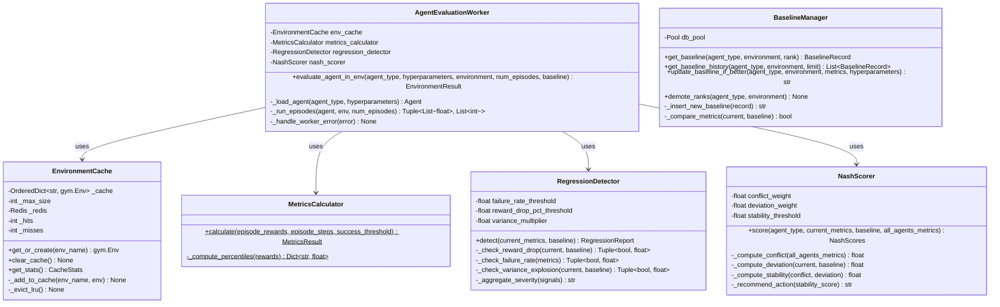
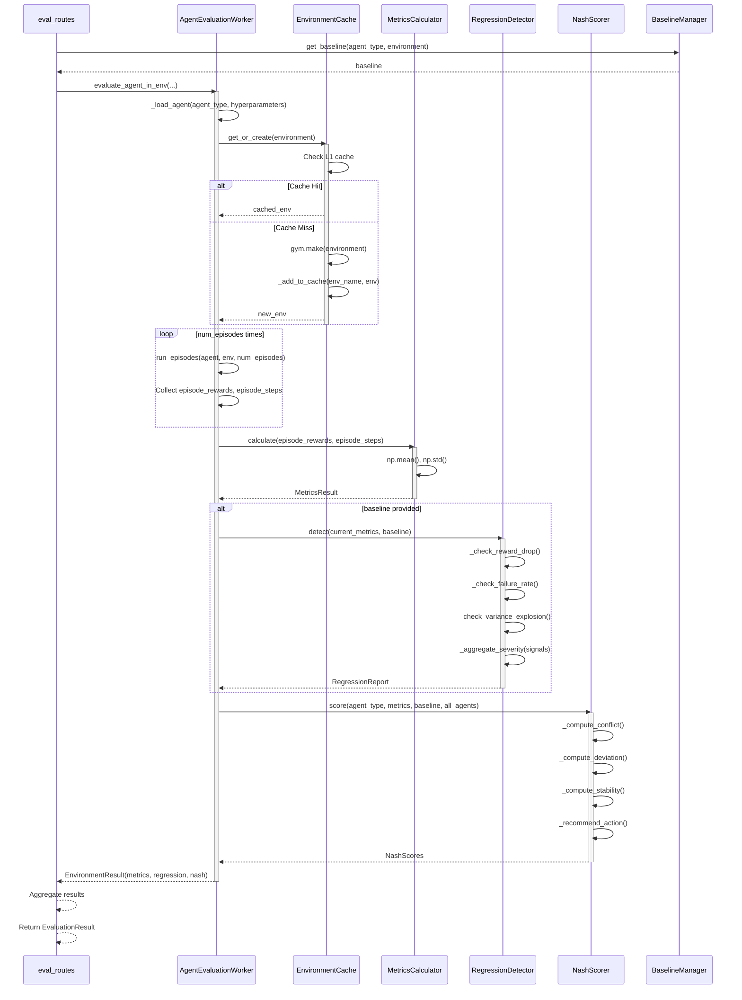
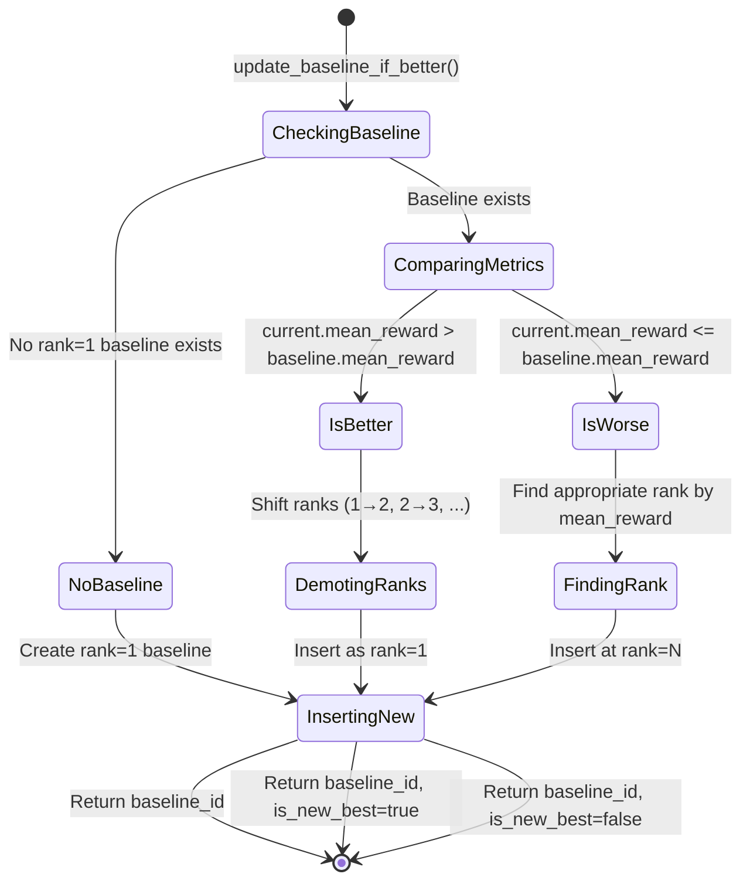
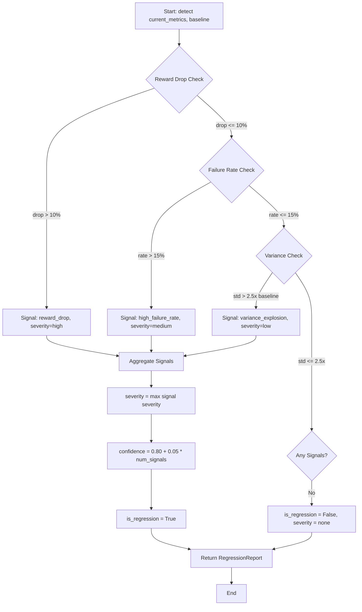
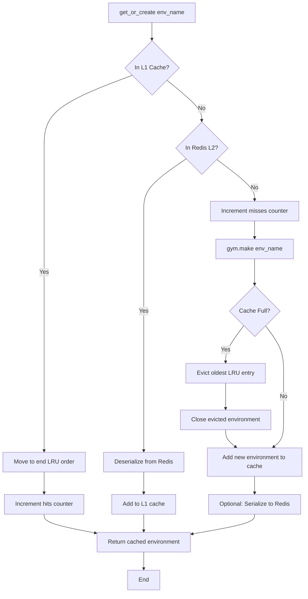
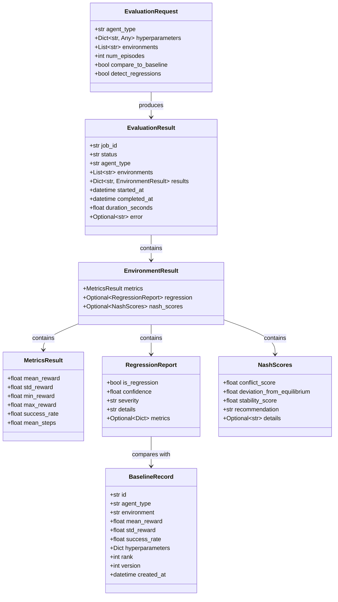
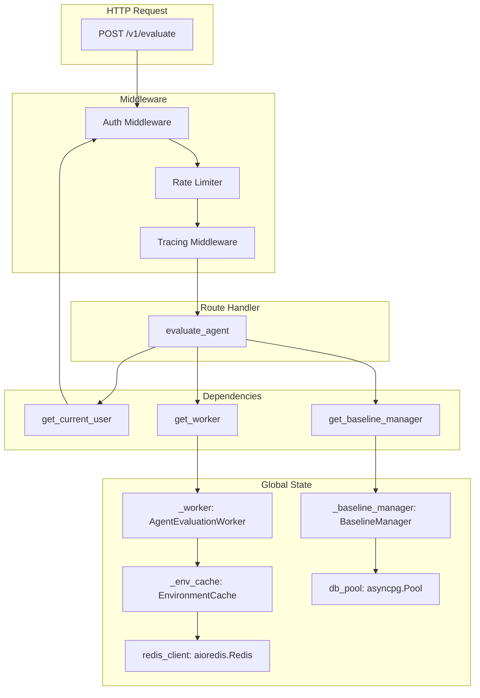

# C4 Level 4: Code Diagram

## T.A.R.S. Evaluation Engine - Code-Level Architecture

This diagram shows the class-level structure and key code patterns for critical components.

## 1. AgentEvaluationWorker - Class Diagram



## 2. Evaluation Flow - Sequence Diagram



## 3. Baseline Management - State Diagram



**SQL for Demoting Ranks:**
```sql
-- Shift all ranks down by 1
UPDATE eval_baselines
SET rank = rank + 1
WHERE agent_type = $1 AND environment = $2;

-- Insert new baseline at rank=1
INSERT INTO eval_baselines (
    agent_type, environment, mean_reward, std_reward,
    success_rate, hyperparameters, rank, version
) VALUES (
    $1, $2, $3, $4, $5, $6, 1, (SELECT COALESCE(MAX(version), 0) + 1 FROM eval_baselines WHERE agent_type=$1 AND environment=$2)
) RETURNING id;
```

## 4. Regression Detection Algorithm



**Code Implementation:**
```python
def detect(self, current_metrics: MetricsResult, baseline: BaselineRecord) -> RegressionReport:
    signals = []

    # Signal 1: Reward drop
    reward_drop_pct = (baseline.mean_reward - current_metrics.mean_reward) / baseline.mean_reward
    if reward_drop_pct > 0.10:  # 10% threshold
        signals.append(("reward_drop", reward_drop_pct, "high"))

    # Signal 2: Failure rate
    failure_rate = 1 - current_metrics.success_rate
    if failure_rate > 0.15:  # 15% threshold
        signals.append(("high_failure_rate", failure_rate, "medium"))

    # Signal 3: Variance explosion
    if current_metrics.std_reward > baseline.std_reward * 2.5:
        signals.append(("variance_explosion", current_metrics.std_reward / baseline.std_reward, "low"))

    if not signals:
        return RegressionReport(is_regression=False, confidence=0.98, severity="none", details="Stable")

    severity = max(s[2] for s in signals)  # "high" > "medium" > "low"
    confidence = min(0.95, 0.80 + 0.05 * len(signals))
    details = "; ".join([f"{s[0]}: {s[1]:.2%}" for s in signals])

    return RegressionReport(
        is_regression=True,
        confidence=confidence,
        severity=severity,
        details=details,
        metrics={s[0]: s[1] for s in signals}
    )
```

## 5. Environment Cache - LRU Implementation



**Code Implementation:**
```python
from collections import OrderedDict

class EnvironmentCache:
    def __init__(self, max_size: int = 50):
        self._cache: OrderedDict[str, gym.Env] = OrderedDict()
        self._max_size = max_size
        self._hits = 0
        self._misses = 0

    async def get_or_create(self, env_name: str) -> gym.Env:
        # L1 cache hit
        if env_name in self._cache:
            self._hits += 1
            self._cache.move_to_end(env_name)  # Mark as recently used
            ENV_CACHE_SIZE.set(len(self._cache))
            return self._cache[env_name]

        # Cache miss
        self._misses += 1
        env = gym.make(env_name)
        self._add_to_cache(env_name, env)
        return env

    def _add_to_cache(self, env_name: str, env: gym.Env):
        # LRU eviction if full
        if len(self._cache) >= self._max_size:
            evicted_name, evicted_env = self._cache.popitem(last=False)
            evicted_env.close()
            logger.info(f"Evicted environment: {evicted_name}")

        self._cache[env_name] = env
        ENV_CACHE_SIZE.set(len(self._cache))
```

## 6. Pydantic Models - Data Flow



## 7. FastAPI Dependency Injection Graph



**Dependency Registration (main.py):**
```python
@asynccontextmanager
async def lifespan(app: FastAPI):
    global db_pool, redis_client, _env_cache, _worker, _baseline_manager

    # Initialize connections
    db_pool = await asyncpg.create_pool(config.postgres_url)
    redis_client = await aioredis.from_url(config.redis_url)

    # Initialize components
    _env_cache = EnvironmentCache(max_size=config.env_cache_size)
    _metrics_calculator = MetricsCalculator()
    _regression_detector = RegressionDetector(
        failure_rate_threshold=config.failure_rate,
        reward_drop_pct_threshold=config.reward_drop_pct
    )
    _nash_scorer = NashScorer()
    _baseline_manager = BaselineManager(db_pool)

    # Initialize worker
    _worker = AgentEvaluationWorker(
        env_cache=_env_cache,
        metrics_calculator=_metrics_calculator,
        regression_detector=_regression_detector,
        nash_scorer=_nash_scorer
    )

    yield

    # Cleanup
    await db_pool.close()
    await redis_client.close()
```

## 8. Error Handling Patterns

### Custom Exception Hierarchy
```python
class EvalEngineException(Exception):
    """Base exception for eval-engine."""
    pass

class EnvironmentNotFoundError(EvalEngineException):
    """Raised when Gymnasium environment doesn't exist."""
    pass

class AgentLoadError(EvalEngineException):
    """Raised when agent fails to load."""
    pass

class EvaluationTimeoutError(EvalEngineException):
    """Raised when evaluation exceeds timeout."""
    pass

class BaselineNotFoundError(EvalEngineException):
    """Raised when baseline doesn't exist."""
    pass
```

### Exception Handling in Worker
```python
async def evaluate_agent_in_env(self, ...) -> EnvironmentResult:
    try:
        agent = self._load_agent(agent_type, hyperparameters)
    except Exception as e:
        raise AgentLoadError(f"Failed to load agent: {e}")

    try:
        env = await self.env_cache.get_or_create(environment)
    except gym.error.UnregisteredEnv:
        raise EnvironmentNotFoundError(f"Environment '{environment}' not found")

    try:
        async with asyncio.timeout(EVAL_WORKER_TIMEOUT):
            episode_rewards, episode_steps = await self._run_episodes(agent, env, num_episodes)
    except asyncio.TimeoutError:
        raise EvaluationTimeoutError(f"Evaluation exceeded {EVAL_WORKER_TIMEOUT}s timeout")

    # Rest of evaluation...
```

### HTTP Exception Mapping
```python
# In main.py
@app.exception_handler(EvalEngineException)
async def eval_engine_exception_handler(request: Request, exc: EvalEngineException):
    status_code = 500
    if isinstance(exc, EnvironmentNotFoundError):
        status_code = 400
    elif isinstance(exc, BaselineNotFoundError):
        status_code = 404
    elif isinstance(exc, EvaluationTimeoutError):
        status_code = 504

    return JSONResponse(
        status_code=status_code,
        content={
            "error": exc.__class__.__name__,
            "message": str(exc),
            "trace_id": request.state.trace_id if hasattr(request.state, "trace_id") else None
        }
    )
```

## 9. Prometheus Metrics Implementation

```python
from prometheus_client import Counter, Histogram, Gauge

# Counters
EVALUATIONS_TOTAL = Counter(
    "tars_eval_evaluations_total",
    "Total agent evaluations",
    ["agent_type", "environment", "status"]
)

REGRESSION_DETECTED_TOTAL = Counter(
    "tars_eval_regression_detected_total",
    "Total regressions detected",
    ["agent_type", "environment", "severity"]
)

# Histograms
EVALUATION_DURATION = Histogram(
    "tars_eval_duration_seconds",
    "Evaluation duration in seconds",
    ["agent_type", "num_episodes"],
    buckets=[10, 30, 60, 120, 300, 600]
)

# Gauges
ENV_CACHE_SIZE = Gauge(
    "tars_eval_env_cache_size",
    "Number of cached environments"
)

# Usage in worker
async def evaluate_agent_in_env(self, ...):
    start_time = time.time()
    try:
        # Evaluation logic...
        EVALUATIONS_TOTAL.labels(agent_type=agent_type, environment=environment, status="success").inc()
        if regression_report.is_regression:
            REGRESSION_DETECTED_TOTAL.labels(
                agent_type=agent_type,
                environment=environment,
                severity=regression_report.severity
            ).inc()
    except Exception:
        EVALUATIONS_TOTAL.labels(agent_type=agent_type, environment=environment, status="failed").inc()
        raise
    finally:
        duration = time.time() - start_time
        EVALUATION_DURATION.labels(agent_type=agent_type, num_episodes=str(num_episodes)).observe(duration)
```

---

**Previous Levels:**
- [C4 Level 1 - System Context](C4_Level1_SystemContext.md)
- [C4 Level 2 - Container Diagram](C4_Level2_Container.md)
- [C4 Level 3 - Component Diagram](C4_Level3_Component.md)
