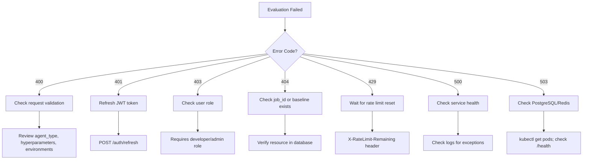

# Evaluation Pipeline Runbook

**Service:** T.A.R.S. Evaluation Engine
**Version:** v1.0.0-rc2
**Last Updated:** 2025-11-19
**Audience:** ML Engineers, SREs, Platform Operators

---

## Table of Contents

1. [Overview](#overview)
2. [Manual Evaluation Trigger](#manual-evaluation-trigger)
3. [Baseline Management](#baseline-management)
4. [Regression Detection](#regression-detection)
5. [Rollback Procedures](#rollback-procedures)
6. [Monitoring & Diagnostics](#monitoring--diagnostics)

---

## Overview

The Evaluation Engine provides real RL agent evaluation with:
- Multi-environment testing
- Performance metrics calculation
- Regression detection
- Nash equilibrium scoring
- Baseline management

### Architecture

```
AutoML → Evaluation Engine → HyperSync
  ↓            ↓                ↓
Optuna    PostgreSQL       Orchestration
           Redis
```

### Key Endpoints

| Endpoint | Method | Purpose |
|----------|--------|---------|
| `/v1/evaluate` | POST | Submit agent for evaluation |
| `/v1/jobs/{job_id}` | GET | Get job status |
| `/v1/baselines/{agent_type}` | GET | Get baseline |
| `/v1/baselines` | POST | Update baseline (admin) |
| `/health` | GET | Health check |
| `/metrics` | GET | Prometheus metrics |

---

## Manual Evaluation Trigger

### Prerequisites

- JWT access token with `developer` or `admin` role
- Agent hyperparameters
- Target environment(s)

### Step-by-Step

#### 1. Authenticate

```bash
# Login to get JWT token
curl -X POST http://localhost:8099/auth/login \
  -H "Content-Type: application/json" \
  -d '{
    "username": "developer",
    "password": "dev_password"
  }'

# Save access_token from response
export ACCESS_TOKEN="eyJhbGciOiJIUzI1NiIsInR5cCI6IkpXVCJ9..."
```

#### 2. Submit Evaluation Request

```bash
curl -X POST http://localhost:8099/v1/evaluate \
  -H "Authorization: Bearer $ACCESS_TOKEN" \
  -H "Content-Type: application/json" \
  -d '{
    "agent_type": "dqn",
    "hyperparameters": {
      "learning_rate": 0.001,
      "gamma": 0.99,
      "epsilon": 0.1,
      "buffer_size": 10000
    },
    "environments": ["CartPole-v1"],
    "num_episodes": 100,
    "compare_to_baseline": true,
    "detect_regressions": true
  }'
```

#### 3. Analyze Response

**Success (200 OK):**
```json
{
  "job_id": "550e8400-e29b-41d4-a716-446655440000",
  "status": "completed",
  "agent_type": "dqn",
  "environments": ["CartPole-v1"],
  "results": {
    "CartPole-v1": {
      "metrics": {
        "mean_reward": 195.5,
        "std_reward": 12.3,
        "success_rate": 0.95
      },
      "regression": {
        "is_regression": false,
        "confidence": 0.98,
        "severity": "none"
      },
      "nash_scores": {
        "stability_score": 0.98,
        "recommendation": "accept"
      }
    }
  }
}
```

**Regression Detected (200 OK with is_regression=true):**
```json
{
  "results": {
    "CartPole-v1": {
      "regression": {
        "is_regression": true,
        "confidence": 0.95,
        "severity": "high",
        "details": "reward_drop: 15%; high_failure_rate: 20%"
      }
    }
  }
}
```

**Error (400/401/429/500):**
```json
{
  "error": "validation_error",
  "message": "Invalid agent_type: must be one of [dqn, a2c, ppo, ddpg]"
}
```

#### 4. Common Evaluation Patterns

**Quick Mode (50 episodes):**
```json
{
  "agent_type": "dqn",
  "hyperparameters": {...},
  "environments": ["CartPole-v1"],
  "num_episodes": 50,
  "compare_to_baseline": false,
  "detect_regressions": false
}
```

**Multi-Environment Evaluation:**
```json
{
  "agent_type": "ppo",
  "hyperparameters": {...},
  "environments": [
    "CartPole-v1",
    "Acrobot-v1",
    "MountainCar-v0"
  ],
  "num_episodes": 100
}
```

**Baseline Comparison Only:**
```json
{
  "agent_type": "dqn",
  "hyperparameters": {...},
  "environments": ["CartPole-v1"],
  "num_episodes": 100,
  "compare_to_baseline": true,
  "detect_regressions": false
}
```

---

## Baseline Management

### View Current Baseline

```bash
curl http://localhost:8099/v1/baselines/dqn?environment=CartPole-v1&top_n=3 \
  -H "Authorization: Bearer $ACCESS_TOKEN"
```

**Response:**
```json
{
  "agent_type": "dqn",
  "environment": "CartPole-v1",
  "current_baseline": {
    "id": "f47ac10b-58cc-4372-a567-0e02b2c3d479",
    "mean_reward": 195.5,
    "std_reward": 12.3,
    "success_rate": 0.95,
    "rank": 1,
    "version": 5,
    "created_at": "2025-11-19T10:00:00Z"
  },
  "history": [
    {
      "id": "e58fb10a-47cc-4271-a466-0d01a1b2c2368",
      "mean_reward": 190.2,
      "rank": 2,
      "version": 4
    }
  ]
}
```

### Update Baseline (Admin Only)

**Requires `admin` role.**

```bash
curl -X POST http://localhost:8099/v1/baselines \
  -H "Authorization: Bearer $ADMIN_ACCESS_TOKEN" \
  -H "Content-Type: application/json" \
  -d '{
    "agent_type": "dqn",
    "environment": "CartPole-v1",
    "metrics": {
      "mean_reward": 198.5,
      "std_reward": 10.2,
      "success_rate": 0.97
    },
    "hyperparameters": {
      "learning_rate": 0.0008,
      "gamma": 0.99
    }
  }'
```

**Response:**
```json
{
  "baseline_id": "a12bc34d-56ef-7890-abcd-ef1234567890",
  "rank": 1,
  "version": 6,
  "is_new_best": true,
  "message": "New best baseline established"
}
```

### Baseline Update Logic

1. **No existing baseline (rank=1)**: Insert as rank=1, version=1
2. **New performance > current best**: Demote all ranks (+1), insert as rank=1
3. **New performance <= current best**: Insert at appropriate rank by mean_reward

**Database Query:**
```sql
-- Check if new baseline is better
SELECT mean_reward FROM eval_baselines
WHERE agent_type = 'dqn' AND environment = 'CartPole-v1' AND rank = 1;

-- If better, demote all ranks
UPDATE eval_baselines
SET rank = rank + 1
WHERE agent_type = 'dqn' AND environment = 'CartPole-v1';

-- Insert new baseline at rank=1
INSERT INTO eval_baselines (agent_type, environment, mean_reward, ..., rank, version)
VALUES ('dqn', 'CartPole-v1', 198.5, ..., 1, 6);
```

---

## Regression Detection

### How Regression Detection Works

The Evaluation Engine uses 3 signals to detect performance regressions:

#### Signal 1: Reward Drop (High Severity)
```python
reward_drop_pct = (baseline.mean_reward - current.mean_reward) / baseline.mean_reward
if reward_drop_pct > 0.10:  # 10% threshold
    severity = "high"
```

**Example:**
- Baseline: mean_reward=200.0
- Current: mean_reward=170.0
- Drop: (200 - 170) / 200 = 15% → **High severity regression**

#### Signal 2: Failure Rate (Medium Severity)
```python
failure_rate = 1 - current.success_rate
if failure_rate > 0.15:  # 15% threshold
    severity = "medium"
```

**Example:**
- Current: success_rate=0.80
- Failure rate: 1 - 0.80 = 20% → **Medium severity regression**

#### Signal 3: Variance Explosion (Low Severity)
```python
if current.std_reward > baseline.std_reward * 2.5:
    severity = "low"
```

**Example:**
- Baseline: std_reward=10.0
- Current: std_reward=30.0
- Ratio: 30 / 10 = 3.0 > 2.5 → **Low severity regression**

### Interpreting Regression Results

| Severity | Reward Drop | Failure Rate | Variance Ratio | Action |
|----------|-------------|--------------|----------------|--------|
| **Critical** | >20% | >25% | >5x | Immediate rollback |
| **High** | 10-20% | 15-25% | 3-5x | Rollback, investigate |
| **Medium** | 5-10% | 10-15% | 2-3x | Review, consider rollback |
| **Low** | <5% | <10% | 1.5-2x | Monitor closely |
| **None** | - | - | - | Accept |

### Regression Report Example

```json
{
  "is_regression": true,
  "confidence": 0.95,
  "severity": "high",
  "details": "reward_drop: 15.2%; high_failure_rate: 18%",
  "metrics": {
    "reward_drop_pct": 0.152,
    "failure_rate": 0.18
  }
}
```

### Tuning Regression Thresholds

**Environment Variables (.env.eval):**
```bash
# Regression detection thresholds
EVAL_FAILURE_RATE=0.15          # 15% failure rate threshold
EVAL_REWARD_DROP_PCT=0.10       # 10% reward drop threshold
EVAL_VARIANCE_MULTIPLIER=2.5    # 2.5x variance threshold
```

**When to adjust:**
- **Decrease thresholds**: For safety-critical applications
- **Increase thresholds**: For experimental/tolerant environments

---

## Rollback Procedures

### Automatic Rollback (via HyperSync)

When a critical regression is detected, the Evaluation Engine can trigger automatic rollback:

```python
# In worker code (future implementation)
if regression.severity == "critical":
    response = requests.post(
        "http://hypersync:8098/v1/rollback",
        json={
            "agent_type": "dqn",
            "reason": f"Critical regression detected: {regression.details}"
        }
    )
```

### Manual Rollback

#### Option 1: Via HyperSync API

```bash
curl -X POST http://localhost:8098/v1/rollback \
  -H "Authorization: Bearer $ACCESS_TOKEN" \
  -H "Content-Type: application/json" \
  -d '{
    "agent_type": "dqn",
    "reason": "Manual rollback after failed evaluation"
  }'
```

#### Option 2: Restore Previous Baseline

```bash
# 1. Get previous baseline (rank=2)
curl http://localhost:8099/v1/baselines/dqn?environment=CartPole-v1&top_n=2 \
  -H "Authorization: Bearer $ACCESS_TOKEN" \
  | jq '.history[0]'

# 2. Promote previous baseline to rank=1
curl -X POST http://localhost:8099/v1/baselines \
  -H "Authorization: Bearer $ADMIN_ACCESS_TOKEN" \
  -H "Content-Type: application/json" \
  -d '{
    "agent_type": "dqn",
    "environment": "CartPole-v1",
    "metrics": {
      "mean_reward": 190.2,
      "std_reward": 15.1,
      "success_rate": 0.92
    },
    "hyperparameters": { ... }
  }'
```

#### Option 3: Database Direct Rollback (Last Resort)

```sql
-- Swap rank=1 and rank=2
BEGIN;

UPDATE eval_baselines
SET rank = 99
WHERE agent_type = 'dqn' AND environment = 'CartPole-v1' AND rank = 1;

UPDATE eval_baselines
SET rank = 1
WHERE agent_type = 'dqn' AND environment = 'CartPole-v1' AND rank = 2;

UPDATE eval_baselines
SET rank = 2
WHERE agent_type = 'dqn' AND environment = 'CartPole-v1' AND rank = 99;

COMMIT;
```

---

## Monitoring & Diagnostics

### Grafana Dashboard

**Dashboard:** `T.A.R.S. Evaluation Engine` (UID: `tars-eval-engine`)

**Key Panels:**
1. **Evaluation Rate**: Success vs. failed evaluations
2. **Evaluation Latency**: p50/p95/p99 latencies
3. **Regression Detection Rate**: By severity
4. **Nash Stability Score**: Multi-agent stability
5. **Environment Cache**: Cache size and hit rate
6. **PostgreSQL/Redis**: Database health

### Prometheus Metrics

```bash
# Evaluation rate
sum(rate(tars_eval_evaluations_total{status="success"}[5m]))

# Failure rate
sum(rate(tars_eval_evaluations_total{status="failed"}[5m]))
/ sum(rate(tars_eval_evaluations_total[5m]))

# p95 latency
histogram_quantile(0.95, rate(tars_eval_duration_seconds_bucket[5m]))

# Regression rate
sum(rate(tars_eval_regression_detected_total[5m]))

# Cache hit rate
sum(rate(tars_eval_env_cache_hits_total[5m]))
/ (sum(rate(tars_eval_env_cache_hits_total[5m])) + sum(rate(tars_eval_env_cache_misses_total[5m])))
```

### Jaeger Traces

**View traces:**
```
http://jaeger:16686
```

**Search for evaluation trace:**
- Service: `tars-eval-engine`
- Operation: `evaluate_agent_in_env`
- Tags: `ml.agent_type=dqn`, `ml.environment=CartPole-v1`

**Typical trace structure:**
```
evaluate_agent_in_env (200ms)
├── load_agent (50ms)
├── run_episodes (100ms)
├── compute_metrics (30ms)
└── detect_regression (20ms)
```

### Health Check

```bash
curl http://localhost:8099/health
```

**Healthy:**
```json
{
  "status": "healthy",
  "version": "v1.0.0-rc2",
  "uptime_seconds": 3600,
  "checks": {
    "postgres": {"status": "healthy", "latency_ms": 2.5},
    "redis": {"status": "healthy", "latency_ms": 1.2}
  }
}
```

**Degraded:**
```json
{
  "status": "degraded",
  "checks": {
    "postgres": {"status": "healthy"},
    "redis": {"status": "unhealthy", "error": "Connection timeout"}
  }
}
```

### Log Analysis

**View logs (Kubernetes):**
```bash
kubectl logs -n tars deployment/tars-eval-engine -f
```

**Search for errors:**
```bash
kubectl logs -n tars deployment/tars-eval-engine | grep ERROR
```

**Filter by trace ID:**
```bash
kubectl logs -n tars deployment/tars-eval-engine | grep "trace_id=abc123"
```

---

## Error Diagnosis Flowchart



---

## Related Documents

- [Troubleshooting Guide](troubleshooting-guide.md)
- [On-Call Playbook](oncall-playbook.md)
- [C4 Architecture Diagrams](../architecture/C4_Level1_SystemContext.md)
- [OpenAPI Specification](../api/openapi.yaml)
